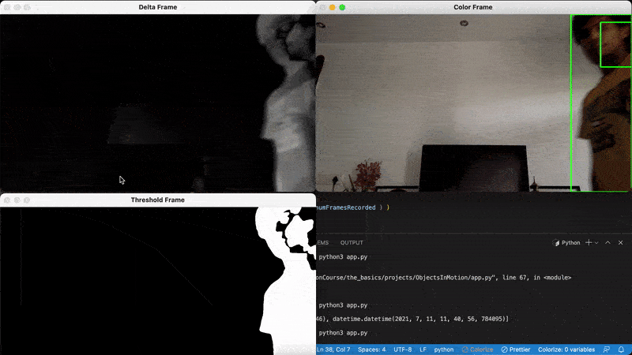

# python_Motion_Detector_OpenCV
Python script to detect objects in motion using OpenCV, storing the detected times in csv using Pandas,  and visualizing the csv on a graph using Bokeh
   

 
### To run Motion Detector and generate graph at end of session:
$`python3 plotting.py`  
Press `q` to end session   
### To run just the Motion Detector:
$`python3 app.py`  
Press `q` to end session   

#### In directory cv2 visionScripts is script to batch identify faces in a folder of images using haarcascade

## Notes:
Objects in motion 
Motion Detector 

Script first needs a static image or baseline image.  
Objects in motion are the objects ,  
that when subtracted with baseline image , still remain.     

The first frame when webcam is started ,  
must be the static image.  

Static image is greyscaled ,  
and all other frames in loop are greyscaled.  
Difference or `Delta frame` is made.   
In difference the object in motion will have  
light behind it from the first static photo.  
All else in photo will be blackened.     

`Threshold Frame` turns the intensity to max ,  
which shows just white or black contracting objects in frame.  
Below Threshold areas are black.   
A contour is made arround the objects in white ,   
and if they are over 500 px then they are considred moving.    

Python captures first frame ,  
converts it to greyscaled ,  
blurs it ,  
and stores the first frame.   
Then calculates difference between  
everyframe proceeding it and first frame.   
Finds contours ,  
and if contours is greater than a value ,  
status is 1 so moving object detected.  
Status list is appended ,  
but status list starts with 0 from first frame ,  
and everytime there is a change from 0 to 1 ,   
or 1 to 0 in status list , then the date time  
is recorded into a csv file using pandas.   

The csv file is loaded as a dataframe using pandas.  
Bokeh using this dataframe,  
graphs the start and end times of the moving detected objects,  
and makes a html file to visualize the data using a graph.  

